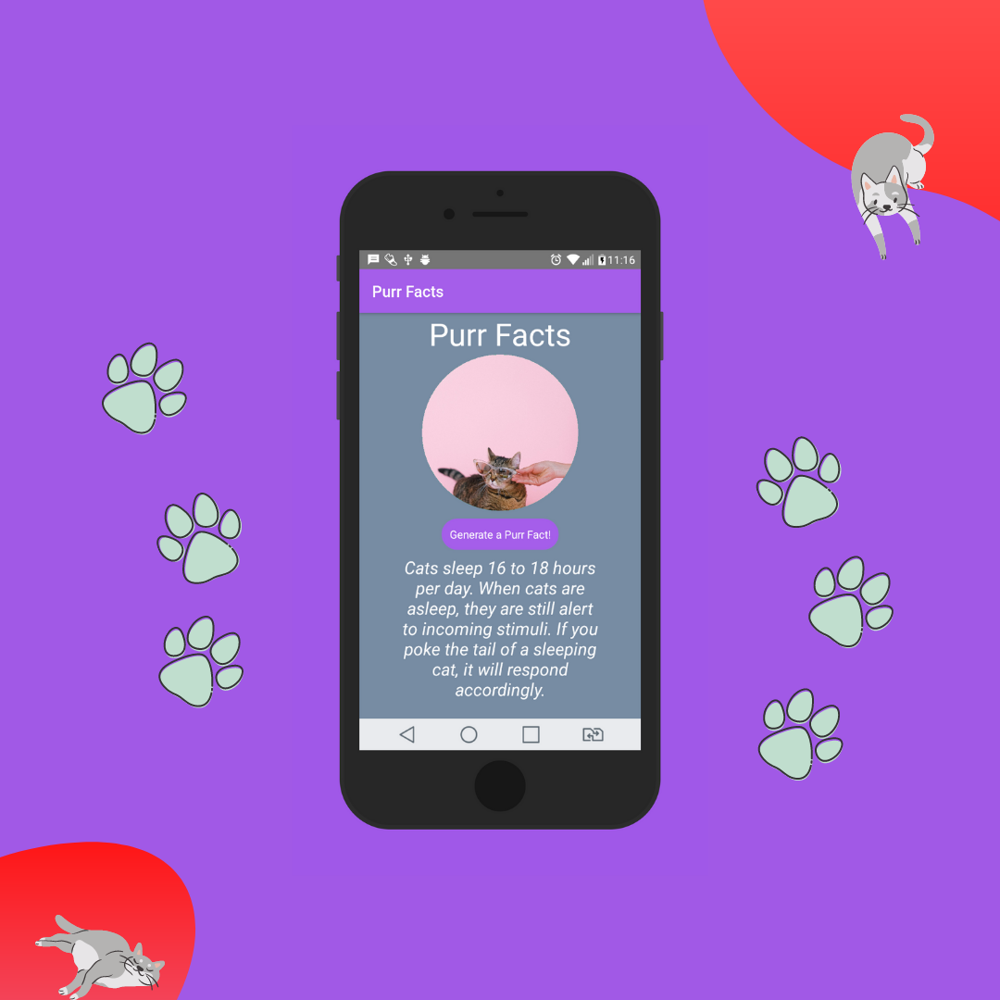
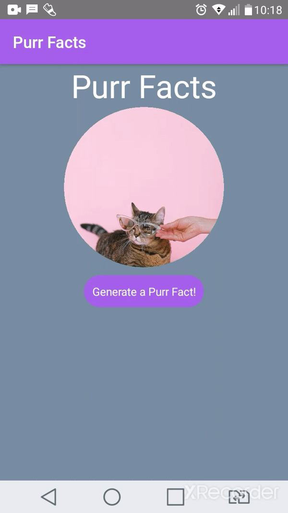

# Purr Facts
A simple App that provides random small text aoubt cats, generated from an pet API called Meow Facts.

## Features:
<ul>
    <li><a href="#preview">Preview</a></li>
    <li><a href="#navigation">React Navigation</a></li>
    <li><a href="#fetch">Calling API with fetch</a></li>
    <li><a href="#props">Using props</a></li>
    <li><a href="#install">Installing App</a></li>
    
</ul>

</br>
</br>
<span id="preview">

## Design Preview:




<span id="navigation">

## React Navigation
I decided to explore more about the last version of React Navigation which brings usefull and easy concepts about how to create a navigation bar for the project and customize it  with Stack Navigator.

<span id="fetch">

## Calling API with ```fetch```

I Used a function ```callFact()``` that gets data from the server with an object randomly each time page is refreshed, so that will return the object as json and rendered in the screen whe user presses the button.
<span id="props">

## Using ```props```

I decided work more on props to practice in this App, so I created 2 components, for the button and the card, and passed data via props on Homescreen, e.g:
</br>
</br>

```<PurrButton onGenerate={callFact} />``` This will pass the function data to the HomeScreen component via props.
<span id="install">

## Install this App
clone this repo:

```git clone https://github.com/alanhcrdz/purrfacts```
</br>
</br>
Install packages

```npm install```
</br>
</br>
Start project

```npm start```

